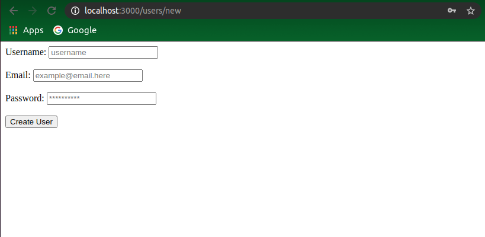

# Forms and Authentication

## Table of contents

- [About](#about)
- [Features](#features)
- [Built with](#built-with)
- [Getting started](#getting-started)
  * [Prerequisites](#prerequisites)
  * [Installation instructions](#installation-instructions)
- [Authors](#authors)
- [Contributing](#-contributing)
- [Show your support](#show-your-support)
- [Acknowledgements](#acknowledgments)
- [License](#-license)

---

## About

This is a form project where user can create a user and edit that user.

## Features

The features of this project are listed as below:

- Create User
- Edit the user

## Built With

- Ruby
- Rails

## Getting Started

### Prerequisites

If you intend to download the project, you will need to have Ruby already installed on your machine. For more information on how to install Ruby, follow [this link.](https://www.ruby-lang.org/en/downloads/)

### Installation instructions

Follow along the steps below to get a copy at your local machine.

- Navigate to the directory where you want this project to live and then clone it `git clone https://github.com/sneeu-leeu/forms-and-Authentication.git`
- Navigate to the `Forms-and-Authentication` directory
- install the gem package with `bundle install`
- Migrate the database on your local machine `rails db:migrate`
- Run command 'rails server'
- Open browser at 'http://localhost:3000/'
## Authors

👤 **Dipesh Bajgain**

- GitHub: [@dipbazz](https://github.com/dipbazz)
- Twitter: [@dipbazz](https://twitter.com/dipbazz)
- LinkedIn: [Dipesh Bajgain](https://www.linkedin.com/in/dipbazz/)

👤 **Stephan Annandale**

- GitHub: [@sneeu-leeu](https://github.com/sneeu-leeu/)
- Twitter: [@Stephan07484055](https://twitter.com/Stephan07484055)
- LinkedIn: [Stephan Annandale](https://www.linkedin.com/in/stephan-annandale-a4b4931a9/)

## 🤝 Contributing

Contributions, issues, and feature requests are welcome!

## Show your support

Give a ⭐️ if you like this project!

## Acknowledgments

- This micro reddit clone is created by following [Odin Project](https://www.theodinproject.com/courses/ruby-on-rails/lessons/building-with-active-record-ruby-on-rails)

## 📝 License

This project is [MIT](./LICENSE) licensed.